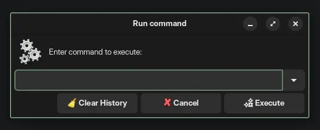
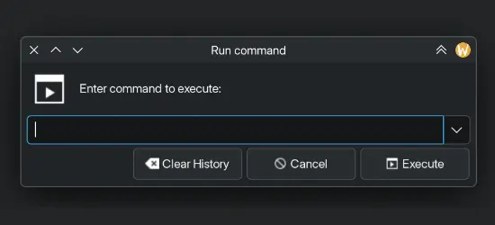

# yad.ts examples

Examples no. 1 to 6 are direct imports from the [*YAD Examples* page of yad-guide.ingk.se](https://yad-guide.ingk.se/examples/examples.html).

## 1. Run dialog

| GNOME                        | KDE                        |
|------------------------------|----------------------------|
|  |  |

Differences from original bash example:

- +28 lines (but +readability) ;
- Uses user's shell history and doesn't save URL launches ;
- Uses `x-terminal-emulator` instead of `xterm` ;
- Backs up history file on clear.